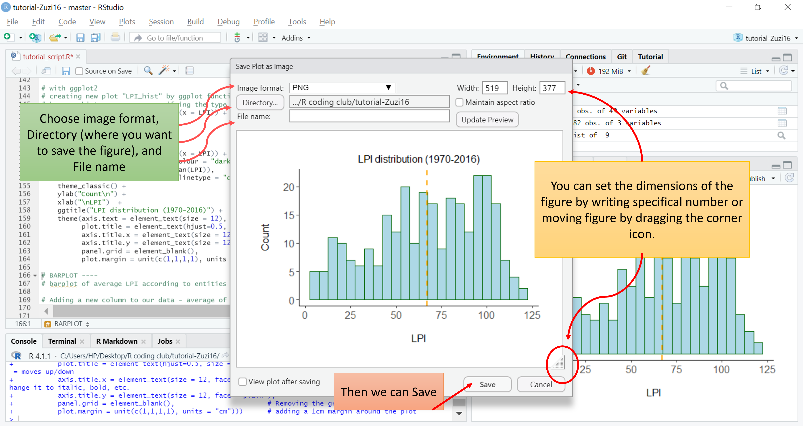
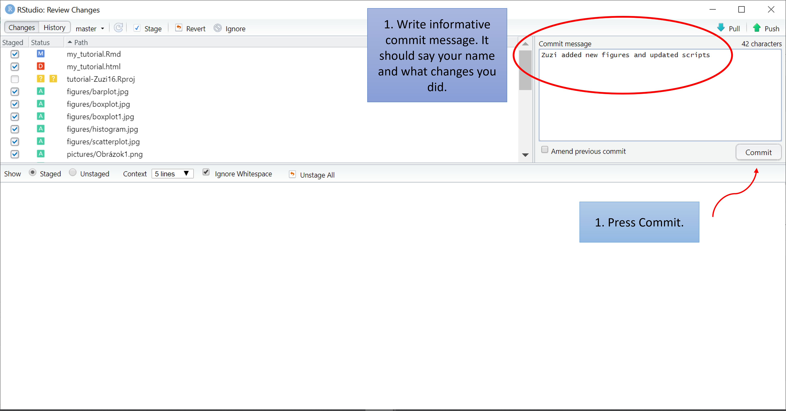
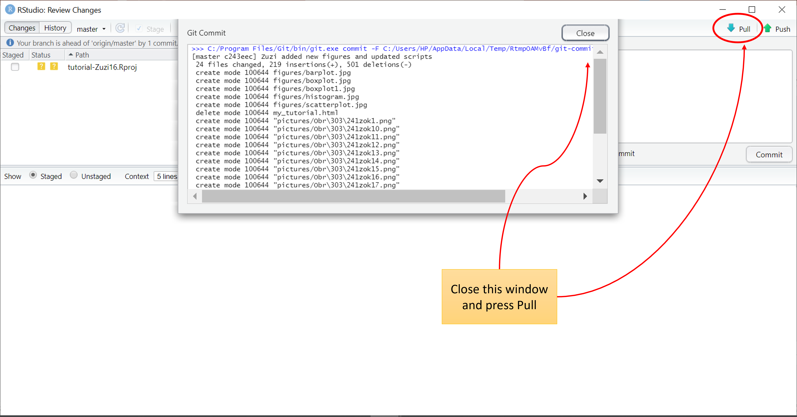
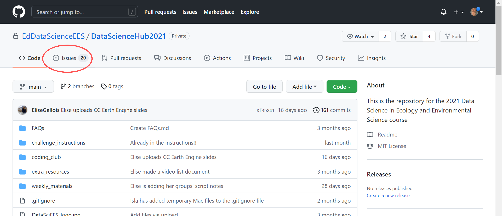

```{r klippy, echo=FALSE, include=TRUE}
klippy::klippy('')
```

In case you are as lost as I was during the first 1-2 weeks of the Data Science course, this tutorial is for you! I promise you won't be so lost anymore. 
To be honest, it is not so overwhelming once you know what are you doing.


There are just few things you need to be ready for: 

- RStudio likes to not cooperate with you very often but try to avoid breakdowns, it will work somehow.

- There will be a lot to do during the semester, but you can do it! 

- They will be telling you it's a lot of fun and you may not agree (especially when your R decides not to work) but it can be fun too. Check these tutorials for some examples: 
  - [Magic figures](https://eddatascienceees.github.io/tutorial-barbora8/)
  - [Cool packages](*will be added) 


## Tutorial aims: 

#### <a href="#section1"> 1. What is R and connecting it to GitHub </a>
#### <a href="#section2"> 2. Starting to code </a>
#### <a href="#section3"> 3. Plotting </a>
#### <a href="#section4"> 4. Saving plots </a>
#### <a href="#section5"> 5. Uploading to GitHub </a>

------


## <a name="#section1">1. What is R and connecting it to GitHub</a>  


You have probably already heard about some of the programming languages such as JavaScript, Python, C, Java... R is also one of them. Actually, in 2021 it was the 8th most useful programming language with an annual salary of  $93,000 [(Northeastern.edu)](https://www.northeastern.edu/graduate/blog/most-popular-programming-languages/). It is used mostly for statistical analysis of large data sets and companies like Facebook, Google, New York Times, BBC, Twitter or Microsoft use it. 


To download R, follow the 1st part of this [tutorial](https://ourcodingclub.github.io/tutorials/intro-to-r/). 

__Now, let’s have a look how at how RStudio looks like:__ 
After opening RStudio, this is what shows up. Click on the New file -> R Script (or press Ctrl + Shift + N)


Now you have all 4 important windows opened. Let's have a look at what each one of them does and what are they for. 


It is the place where you can type any function, or part of the code which you need help with. It will show its description, usage, value, arguments that can be used within the function, and also some examples of how to use it. 

You are going to write all the codes into the __Script__. The results, error and warning messages will show up in the __Console__ window. Created dataframes, vectors or objects will be shown in the __Environment__ window. In the right bottom window, 3 parts are most important and will be mostly used: _Files, Plots_ and _Help_.

In the _Files_ window you can find any files and folders in your computer. It is useful when you want to check where your files are saved or to find the filepath of the file. Also, you can easily check if your plots are being saved. 

In the _Plots_ Section all of the figures you coded in the __Script__ will be shown. You can use the arrows in the top-left corner of the window to see all the plots. 

Lastly, the _Helper_. 
You can also Google any kind of problem and there are many helpful pages on the Internet where you can find help. To be honest, coding is mostly googling (personally, I cant remember the codes so Google is my very good friend).


------

During the semester, you will mostly use R connected to _GitHub_, therefore, lets connect them straight away. 

[GitHub](https://github.com/) is a platform used by coders. We will use it mostly with R. It allows you to have a record of your project safely online. Just think about something like ICloud or OneDrive for your RStudio work. However, it has some more functions we will be using such as Issues. There you can post any of your problems with coding, and the team of tutors or your classmates will help you. I will talk about the Issues at the end of this tutorial. 

Now, lets connect __R__ with __GitHub__.
You need to create an account on [GitHub.com](https://github.com/) and follow the instruction for downloading Git to your computer in this [tutorial](https://ourcodingclub.github.io/tutorials/git/#github4). Please, do the 1st and 3rd part of the tutorial and come back here 😊. 


Your Git should now be set up and connected to R. __Now you are ready to start the semester easily!__ 

Now, let's say you have your course repository on GitHub and you want to work on it in RStudio. During the whole course, all Challenges will have a specific repository which you will need to connect to RStudio to be able to upload changes to GitHub. One of the final assessments is to have your Course Repository nicely organised and full of the work you did during semester. In the course repository you should do all of the Coding Club tutorials. Here, you can check this [tutorial](https://eddatascienceees.github.io/tutorial-assignment-beverlytan/?fbclid=IwAR2nZpJNooLuqdtYIt0VqVmVULTClCNpI-3uC6ZmKNanBiRVIoHxbypG4IQ) how to make your repository nice. 

Now we will connect your __Course Repository__ to Git in the _same way as you will connect your Challenge repositories_. 

On GitHub you need to go to your repository. Click on the green __Code__ box and __copy the web URL address__. 


This way you will create a _"version control project"_ – the project in RStudio which will be connected to GitHub and you will be able to upload your work from there. 

Now go back to RStudio. Click on _File_ -> _New Project_. Choose _Version Control_ and then _Git_.


Paste the URL address to _Repository URL_ box and choose the folder where your repository will be saved in the computer. I created one folder where I am saving all of my repositories. 


Now, you can see a new tab in the Environment window called __Git__. That's the sign all went great and you are connected! There are some additional tasks you need to do when you are connecting your R Studio to Git for the first time, but you can follow the previously mentioned [tutorial]() for this. 


------


## <a name="#section2">2. Starting to code</a> 

 
Here we are! Now we are ready to _start coding_. 

For this tutorial, you can find all the useful data in this [__repository__](https://github.com/EdDataScienceEES/tutorial-Zuzi16). Click on the green __code__ box but now choose __download ZIP file__. Then, _extract_ ZIP into the folder you created for this tutorial in your course repository. 


__A. Introduction__

At the beginning, all of your scripts should include the _name of the tutorial_ you are doing (or assessment) - basically what is this script about, _your name_, _contact_ and _date_. It is recommended to avoid date formats that can be misunderstood such as European or American types. You can use: 6 December 2021

```{r, class.source='klippy', results='hide'}


# Data Science: Tutorial                       # note down information about course/Coding club and tutorial
# My first day in RStudio
# Zuzi Koscikova, zuzkakoscikova@gmail.com     # write down your name and contact
# 6 December 2021                              # date should not be in the format easily switched with European/American one

```


__NOTES:__

•	# : To write comments (anything which you don’t want to be part of the code, you need to start with a hashtag  __#__  at the beginning of line.

• It is considered good etiquette to have spaces within your code between operators. R won't give error messages if you do not do this, however, it is still recommended to make your code more clear and legible.

• The script should be clear and reproducible. Therefore, you should keep commenting what you are doing and what the code means. Ideally you should finish your lines before the margin (vertical grey line suggesting end of the code line).

• __To run the code, press Ctrl + Enter__


__B. Packages__

R is working with the different packages, which include different functions. Before you start working on some code, usually you need to have packages installed and loaded. Although, you can also code in base R which means you don't need to have any packages installed (because R itself includes some functions). In the Data Science course, however, most of the tasks require specific packages so lets look at them:


```{r, class.source='klippy', results='hide', message=FALSE, warning=FALSE}

# Install packages ----
# In this tutorial we will need only tidyverse package which include many others that are used in Data Science

# "install.packages" is a function we need to use for installing the required package. 
# in the brackets is name of the package in the quotations ""
## NOTE: DELETE THE HASHTAGS IN FRONT OF THE FOLLOWING CODE
#install.packages("tidyverse")  # package for data manipulation includes tidyr, dplyr, ggplot2, readr...

# Load the packages ----
# Load the packages using "library"
library(tidyverse)


# (Note: Normally it should work without using "" quotations when loading the packages
# however, if it is not working, try with them (this is working for me))

```


To add a __section__ in the script, write _4 dash lines_ after the comment. The sections can be seen by clicking on the horizontal lines symbol in the upper right corner of the Script window. The more hashtags you add, the more to the right the title will be moved (6 is the max). This can be used if you have different subsections in your script.


__C. Loading the data__

In most of the tutorials from Coding Club and during course tutorials, data will be provided in _csv format_, which you will need to load. For this tutorial, you can find all the useful data in this [__repository__](https://github.com/EdDataScienceEES/tutorial-Zuzi16).

To load the data, you need to tell R the "relative filepath" which is the filepath within your project folder (part that is not specified in the _working directory_). To see your working directory, write __getwd()__. In the console, the filepath for your working directory will be seen. 
For example:

```> getwd() 
[1] "C:/Users/HP/Desktop/R coding club/tutorial-Zuzi16" ```


As I have the data file in the _"data"_ folder in the _"tutorial_Zuzi16"_ folder, I do need to specify the filepath. When you are doing this tutorial in your course repository folder, you will probably need to specify the rest of the path (depending where you extracted the ZIP folder) which is not specified by your working directory. 
For example:

```data <- read.csv("Tutorials/My first day in R/LPIdata.csv")```


```{r, class.source='klippy', results='hide'}
# Starting with the code ----

# usually there will be some data provided in csv format you will need to use. 
# when doing tutorials of coding club tutorials, from the github repository you can download ZIP folder. 
# Extract ZIP folder to your course repository folder in the computer. 

## Loading the data ---- 
getwd()
data <- read.csv("data/LPIdata.csv")
# data: name of your dataframe
# <- : assign symbol 
# read.csv: function used for loading the data in csv format
# ("data/LPIdata.csv"): full filepath and name of the file (with its format) at the end 
```

You can name your data as you want (but be careful this time, because you will need to change it also in the following codes provided). In the brackets of read.csv you need to write the full filepath with the name of the file at the end. Write it in speech marks. 

In this tutorial, we will have a look at the Living Planet Index (LPI) across the world between years 1970 and 2016. 

After loading the data, it will be shown in the _Environment_. 


__D. Checking the data__

Now we can __check the data__. There are different functions for it. I think the most useful are summary and glimpse.

• _Summary_ will tell you min, max, median, mean, first and third quartile of each column.

• _Glimpse_ will tell you number of rows, number of columns, and some of the values of each column as well data type such as character, factors, numeric, integer, logical, or complex. Here we have character (chr), integer (int) and dbl stands for double class (numeric values with decimal points). 
We can also open the dataframe by _clicking on the data in Environment window_.


```{r, message = FALSE, class.source='klippy', results='hide'}

## Checking the data ----
summary(data)
glimpse(data)
```

__E. Long format__

We can see the data are very wide, because we have all the years in one row. It is, however, better and more easy-to-read to have them in the _long format_. Lets transform it: 

First we need to __open our data frame__ - by clicking on it in the Environment window and __check which columns we need to move__. Go with the cursor on the first year column and information will show up.

 

The first column we need is column 3, the last is 49. 

```{r, message = FALSE, class.source='klippy', results='hide'}
## Long format ----
# We will transform the wide dataframe into long format by moving all the year columns into one, where they will be below each other. 
# We need to check in the dataframe to see which columns are they in 

data_long <- pivot_longer(data, cols=3:49, names_to = "year", values_to = "LPI")
# data_long: name of new dataframe
# pivot_longer: operator we are using for transformation of the data
# in the bracket: (data: original data, 
#                  cols=: original columns which needed to be transformed, 
#                  names_to=: name of the new column, where all the names from original columns (so all #years) will be moved, 
#                  values_to=: name of the new column where all the values from original columns (so all the LPI values) will be moved)

```


__F. Fixing the dataframe__

if you check the data now, they are in 4 columns. However, we have _all years with X at the beginning_. This can be easily solved by _mutate_ and _parse_number_ functions. 

```{r, message = FALSE, class.source='klippy', results='hide'}

## Deleting the X in front of the year values ----
data_long <- mutate(data_long, year = parse_number(year))

# data_long: name of the new dataframe
# mutate: operator by which we will create column "year"  
# in the brackets: (data, column = )
#        - data_long: We have the same, because we do not need to create another dataframe, we want only change our "data_long" one. 
#       - year: name of (new) column 
#       - parse_number: operator that will extract only numerical values from the (original) column (year)

```

__G. Pipes__

There are different ways to code. It is preferred to have the script as clear as possible with minimal repetitions. That's why we will use pipes __"%>%"__ (you can also press Ctrl + Shift + M) which can simplify our code by writing more steps into one code: 
Let's join 2 previous codes into one: 

```{r, message = FALSE, class.source='klippy', results='hide'}
## Using pipes ----

data_long <- data %>% 
  pivot_longer(cols = 3:49,            # long format
               names_to = "year",
               values_to = "LPI") %>% 
  mutate (year = parse_number(year))   # deleting X in front of the years 

str(data_long$LPI)     # checking the specific column value type
str(data_long$year)
```

First we will write _new data frame (or object)_ we want to create. By the arrow we will assign the _original data_, which should be changed. As we have already said to R, which data we are using, we no longer need to write it again within operator. 

__H. Deleting columns and values__

Sometimes you have values and columns in your data that you _don't need_. In our data, "Entity" includes values for reptiles or the whole world. We also have the column "Code" which we do not need. Let's delete them:

```{r, message = FALSE, class.source='klippy', results='hide'}
# Check what different values we have in specific columns
unique(data_long$Entity) # use unique for checking the values
unique(data_long$year)

## Deleting unnecessary data using pipes ----

data_long <- data_long %>% 
  filter(Entity != "Reptiles") %>% 
  filter(Entity != "World") %>%         # deleting unnecessary data from Entity column
  select(-c("Code"))                    # deleting useless column Code
  
  
# We also can connect all of the previous changes into one pipe
data_long <- data %>% 
  pivot_longer(cols = 3:49,               # changing to long format
               names_to = "year",
               values_to = "LPI") %>% 
  mutate (year = parse_number(year)) %>%  # deleting X in front of the years
  filter(Entity != "Reptiles") %>%        # deleting Reptile data
  filter(Entity != "World") %>%           # deleting World data
  select(-c("Code"))                      # deleting column Code
  
```


------

## <a name="#section3">3. Plotting</a>

Now, our data are ready for some plotting. In this tutorial we will cover 4 types of graphs you can create, using _base R_ and _ggplot2_ package. 

 __A. Histogram__
 
First, let's have a look at __histograms__. Often, histograms are used for checking the distribution of the data we are working with. With this code, we will plot the histogram to see _the frequency of LPI (living planet index) across different locations and in the range of 46 years (1970-2016)_. 

Each of the graphs can be made by both base R and ggplot2. We will create a histogram in both, but as in Data Science it is most common to create figures in ggplot2, we will continue with that. 

```{r, class.source='klippy', results='hide'}
# Plotting ---- 

## Histogram of the LPI 
# with base R
hist(data_long$LPI)                           # histogram of the LPI column from data_long dataset
hist(data_long$LPI, breaks = 30)              # try change number for breaks, it will change the distribution of bars
# with abline we can add horizontal (with h) or vertical (with v) lines on the plot. 
# we can plot median, mean or specific number 
abline(v=mean(data_long$LPI), col = "red")    # we can also add line of mean, median or other specific number, we can change colour
abline(h=10, col = "blue")


# Beautifying of base R histogram
par(cex.main = 1, cex.lab=0.9, cex.axis = 0.7)      
# size of the title (cex.main) and size of axis labels (cex.lab), size of axis values (cex.axis)
hist(data_long$LPI,                         # histogram of the LPI column from data_long dataset
     main= "LPI distribution (1970-2016)",  # plot title
     xlab= "LPI",                           # x-axis label
     ylab= "Frequency",                     # y-axis label
     col= "bisque",                         # changing colour
     breaks = 30)                           # specifying bars distribution
abline(v=mean(data_long$LPI), col="red3")   # adding mean line in red colour
```

For colour palette for base R, check this [link](http://www.stat.columbia.edu/~tzheng/files/Rcolor.pdf). 

Now let's try it with the __ggplot2 package__. This package allows us to make much nicer plots and has many functions. 

```{r, class.source='klippy', results='hide', message=FALSE, warning=FALSE}

# with ggplot2
# creating new plot "LPI_hist" by ggplot function, from the "data_long" data, where we are changing x axis name to LPI
# by geom_histogram we are specifying the type of the plot we want
(LPI_hist <- ggplot(data_long, aes(x = LPI)) +     
      geom_histogram())


# Beautifying
(LPI_hist <- ggplot(data_long, aes(x = LPI)) +                
    geom_histogram(binwidth = 5, colour = "dark green", fill = "light blue") +    # Changing the binwidth and colours of the bars.   
    geom_vline(aes(xintercept = mean(LPI)),                                # Adding a line for mean abundance
               colour = "orange", linetype = "dashed", size=1) +           # Changing the look of the line
    theme_classic() +                                         # Changing the theme to get rid of the grey background
    ylab("Count\n") +                                         # Changing the text of the y and x axis label
    xlab("\nLPI")  +                                          # \n adds a blank line between axis and text
    ggtitle("LPI distribution (1970-2016)") +                 # Adding plot title
    theme(axis.text = element_text(size = 12),                # Changing font size of axis labels and title
          plot.title = element_text(hjust=0.5, size = 12),         # hjust = moves to the right/left, vjust = moves up/down
          axis.title.x = element_text(size = 12, face = "plain"),  # face="plain" is the default, you can change it to italic, bold, etc. 
          axis.title.y = element_text(size = 12, face= "plain"),
          panel.grid = element_blank(),                       # Removing the grey grid lines
          plot.margin = unit(c(1,1,1,1), units = "cm")))      # adding a 1cm margin around the plot
```

- __"aes"__ = aesthetic:  this is where you _specify your data source and variables_, and _the properties of the graph which depend on those variables_. If you want all data points to be the same colour, you would define the colour = argument outside the aes() function. If you want the data points to be coloured by a factor’s levels (e.g. by site or species), you specify the colour = argument inside the aes()

- _colour_ and _fill_ in geom_hist: "colour" colours the outside (lines) of the bars, while "fill" colours the the inside of the bars. 


 __B. Barplot__

Another type of plot you can create in R is __barplot__. With our data, we will create a barplot of _average LPI values over the 46 years in different locations_. For this we will need to first add a new column to our data with calculated LPI average. 

```{r, class.source='klippy', results='hide'}

# BARPLOT ----
# barplot of average LPI according to entities 

# Adding a new column to our data - average of LPI 
data_long <- data_long %>%    
  group_by(Entity) %>%            # grouping the data by Entity (does similar thing as having data in wide format)
  mutate(LPIaverage = mean(LPI))  # "mutate" creates new column with the name "LPIaverage" which values will be mean of LPI column

# creating the barplot called "LPI_aver_barplot" from "data_long" data. In our aesthetic we need to specify x and y axis (the names of the specific column used). 
# "fill" in aes tells R to colour the bars according to different Entities. 
(LPI_aver_barplot <- ggplot(data_long, aes(x = Entity, y=LPIaverage, fill=Entity))
  + geom_bar(position = position_dodge(), stat = "identity"))

# Beautifying
(LPI_aver_barplot <- ggplot(data_long, aes(x = Entity, y = LPIaverage, fill=Entity)) +
    geom_bar(position = position_dodge(), stat = "identity") +   # we need to use stat = "identity" when using "geom_bar" and own y-axis values 
    theme_classic() +
    ggtitle("Average LPI (1970-2016)") +                   # plot title
    ylab("LPI") +                                          # y-axis title
    xlab("Entity")  +                                      # x-axis title
    scale_y_continuous(expand = c(0,0)) +                  # deleting gap between x-axis and plot
    theme(axis.text.x = element_blank(),                   # deleting names of Entities form x-axis
          axis.text.y = element_text(size = 10),           # changing size of y-axis labels
          axis.title = element_text(size = 12, face = "plain"),   # adjusting axis titles size and format
          plot.title = element_text(size = 12, hjust=0.5),        # adjusting plot title size and position
          panel.grid = element_blank(),                           # deleting grid
          legend.text = element_text(size = 10, face = "italic"), # setting the font for the legend text
          legend.title = element_blank(),                         # removing the legend title
          legend.position = "right"))                             # setting legend position 


```


__C. Boxplot__

Next, we will create a __boxplot__ of _LPI variation across locations_. 
Boxplots shows us median (horizontal line in the box), minimum (end of the lower vertical line), maximum (end of the upper vertical line), 1st and 3rd quartile (lower and upper box edges), and outliers (dots). 

```{r, class.source='klippy', results='hide'}

# BOXPLOT ----

# creating plot called "LPI_boxplot" by ggplot from "data_long" data. The aesthetic includes x axis and y axis specification. 
# "geom_boxplot() specifyies type of the plot
(LPI_boxplot <- ggplot(data_long, aes(Entity, LPI)) + geom_boxplot())  


# Beautifying
(LPI_boxplot <- ggplot(data_long, aes(Entity, LPI)) +             
    geom_boxplot(aes(fill = Entity)) +                             # adding colour of the boxes by Entity (fill=Entity)
    theme_classic() +                                              # changing theme
    ggtitle("LPI variation across location (1970-2016)")  +        # plot title
    ylab("LPI") +                                                  # y-axis title
    xlab("\nLocation")  +                                          # x-axis title
    theme(axis.text.x = element_blank(),                           # deleting x-axis labels (because we have it in the legend)
          axis.title = element_text(size = 14, face = "plain"),    # adjusting axis titles                    
          panel.grid = element_blank(),                            # removing the background grid lines  
          plot.title = element_text(size = 12, hjust=0.5),         # adjusting plot title   
          plot.margin = unit(c(1,1,1,1), units = , "cm"),          # adding a 1cm margin around the plot
          legend.text = element_text(size = 10, face = "italic"),  # setting the font for the legend text
          legend.title = element_blank(),                          # removing the legend title
          legend.position = "right"))                              # setting legend position 

```


__D. Scatterplot__

The last plot we will create today is a __scatterplot__. From our data we will create a scatterplot of _yearly LPI values for each of the location_. 

```{r, class.source='klippy', results='hide', message=FALSE, warning=FALSE}
# SCATTERPLOT
# scatterplot of LPI for each location

# creating a plot called "LPI_scatter" by ggplot from "data_long" data. We are specifying columns for x and y axis and the colour difference based on location
# geom_point() specifies type of the plot
(LPI_scatter <- ggplot (data_long, aes(x = year, y = LPI, colour = Entity)) + geom_point())

# Beautifying
(LPI_scatter <- ggplot(data_long, aes (x = year, y = LPI, colour =Entity)) +
    geom_point(size = 1.2) +                        # changing point size
    geom_smooth(method = "lm", se=FALSE) +          # adding linear model fit (method=lm), deleting standard error ribbons (se=false)
    theme_classic() +                                             # changing theme 
    ggtitle("Yearly LPI in different locations (1970-2016)")  +   # plot title
    ylab("LPI\n") +                                               # y-axis title
    xlab("\nYear")  +                                             # x-axis title
    theme(axis.text.x = element_text(size = 10, angle = 45, vjust = 1, hjust = 1),  # adjusting x-axis labels (size, angle, vjust and hjust - vertical and horizontal position)
          axis.text.y = element_text(size = 10),                    # adjusting y-axis labels
          axis.title = element_text(size = 12, face = "plain"),     # adjusting axes titles     
          panel.grid = element_blank(),                             # removing the background grid lines               
          plot.margin = unit(c(1,1,1,1), units = , "cm"),           # adding a 1cm margin around the plot
          plot.title = element_text(size = 12, hjust=0.3),          # adjusting plot title 
          legend.text = element_text(size = 10, face = "italic"),   # setting the font for the legend text
          legend.title = element_blank(),                           # removing the legend title
          legend.position = "right"))                               # setting legend position 


```


## <a name="section4">4. Saving plots</a> 

__A. Saving with ggsave() by name of the plot__

Almost at the end! Now we need to _save our beautiful figures_. When using the ggplot package, you can use the __ggsave__ function right below the code for the plot. If you know the name of your plot, you can also save it wherever you want in your script. 
Like this: 

```{r, class.source='klippy', results='hide', message=FALSE, warning=FALSE}
# 4. Saving the plots ----

getwd()  # to remember your working directory to be able to specify where the plot should be saved 

## Saving plots by their name ----
ggsave("figures/histogram.jpg", plot=LPI_hist)
ggsave("figures/barplot.jpg", plot=LPI_aver_barplot, width=7) 
ggsave("figures/boxplot.jpg", plot=LPI_boxplot, width=7)
ggsave("figures/scatterplot.jpg", plot=LPI_scatter, width=7)

```

First, in the brackets we need to _specify the filepath_ where your plot _will be saved_ finished by the _name of the figure.jpg_ (if you want to save it in jpg format). 
It can look like this: 
```ggsave("Tutorials/My first day in RStudio/Figures/histogram.jpg", ...)```
Second, you need to tell R _which plot you want to save_. Remember, each of the plots we created has a name at the beginning. 
When your plot is saved in weird dimensions, they can always be changed - try the number that works the best for you. You can also specify height= xx. 

__B.Saving by ggsave() right after the plot__

If you want to __save plots right after their code__, you will need to just specify the filepath and name of the figure created. 
Like this: 
```{r, class.source='klippy', message=FALSE, warrning=FALSE, error=FALSE, results='hide', fig.show="hide"}
# Boxplot 
(LPI_boxplot <- ggplot(data_long, aes(Entity, LPI)) +             
    geom_boxplot(aes(fill = Entity)) +                            
    theme_classic() +                                              
    ggtitle("LPI variation across location (1970-2016)")  +       
    ylab("LPI") +                                                  
    xlab("\nLocation")  +                                            
    theme(axis.text.x = element_blank(),                           
          axis.title = element_text(size = 14, face = "plain"),                      
          panel.grid = element_blank(),                              
          plot.title = element_text(size = 12, hjust=0.5),           
          plot.margin = unit(c(1,1,1,1), units = , "cm"),          
          legend.text = element_text(size = 10, face = "italic"),  
          legend.title = element_blank(),                          
          legend.position = "right")) 
ggsave("figures/boxplot1.jpg", width=7, height= 3.5)     # adding ggsave code with specified dimensions and filepath + name of the figure
```

__C. Saving plot using png() and dev.off()__

Another way how to save figures is by code __"png()"__ and __"dev.off()"__. This is mostly used for figures not created by ggplot2 package, but it works with it too. I will show you how to save our first histogram (made in base R) and then the boxplot made with ggplot2 package. 

```{r, class.source='klippy', message=FALSE, warrning=FALSE, error=FALSE, results='hide', fig.show="hide"}

## Saving by png() and dev.off() ----
# this is used mostly for plots not made by ggplot2, but works for any. 
# write png("filepath/figure.png") before the figure code. 
# write dev.off() right after the code

# saving histogram made in base R
png("figures/histogram1.png")    # specify filepath where figure will be saved in same way as for ggplot2
par(cex.main = 1, cex.lab=0.9, cex.axis = 0.7)      
hist(data_long$LPI,                         
     main= "LPI distribution (1970-2016)",  
     xlab= "LPI",                          
     ylab= "Frequency",                     
     col= "bisque",                         
     breaks = 30)                           
abline(v=mean(data_long$LPI), col="red3") 
dev.off()

# saving boxplot made by ggplot2
png("figures/boxplot2.png", width=750)
(LPI_boxplot <- ggplot(data_long, aes(Entity, LPI)) +             
    geom_boxplot(aes(fill = Entity)) +                            
    theme_classic() +                                              
    ggtitle("LPI variation across location (1970-2016)")  +       
    ylab("LPI") +                                                  
    xlab("\nLocation")  +                                            
    theme(axis.text.x = element_blank(),                           
          axis.title = element_text(size = 14, face = "plain"),                      
          panel.grid = element_blank(),                              
          plot.title = element_text(size = 12, hjust=0.5),           
          plot.margin = unit(c(1,1,1,1), units = , "cm"),          
          legend.text = element_text(size = 10, face = "italic"),  
          legend.title = element_blank(),                          
          legend.position = "right")) 
dev.off()

```


You can check all of the saved figures in the __File__ window any time. There you can also see if the plot was saved (look for time when they were modified). 

------
__Now your turn.__ Try to save all of the plots we created by adding _ggsave()_ or _png()_ and _dev.off()_ to each of them. You can name them differently, so you can easily tell them apart. Do they need different dimensions specifications? Which saving method do you prefere? 
------

__D. Saving plots manually__ 

There is also another way, how to save your figures manually. In your _Plot_ window, choose figure you want to save and click __Export__ -> Save as Image. 


Then choose _Image format_, _directory_ and write _name of the figure_. Size of the figure can be change by specific numbers or by dragging the symbol at the bottom-right corner.



## <a name="section5"> 5. Uploading to GitHub </a>

WOHOUUU everything is done and saved. Now, last thing - I promise - we need to __upload our work to GitHub__ because of a few things: 

- You never know when R will decide to not cooperate with you, so you will have your work saved online too.

- Also, your computer can decide not to work, because of all the assessments it needs to do with you.

- Data Science tutors want to see some progress over the semester in your repository and you will get some points for engagement too. 

- It is very clever to upload your work continuously because GitHub will then have saved all of your file versions which you may need if you realize you did something absolutely wrong. 

So, as your RStudio is already connected to Git, this process is easy. 

<center> __BUT FIRST REMEMBER THIS PRAYER: COMMIT - PULL - PUSH__ </center> 

1. Click on __Git__ in right top window


2. __Mark__ all new or changed files and folders you want to upload to GitHub. 

3. Click __Commit__.


4. Write an informative __commit comment__. 

5. Press __Commit__.



6. Close the Git Commit Window.

7. Press __Pull__.



8. Close Git Push Window

9. Press __Push__.

10. Everything should be uploaded on GitHub  (unless there is an error message)!


11. __Check__ your repository on GitHub


ALL DONE! 
So, are you as lost as you were at the beginning of this tutorial? I hope not!


------

### Issues 


Is there some problem? Try to write an __Issue__ in your Course Hub repository. 

Go to your __Course Hub repository__. Click on __Issues__ -> __New Issue__. 




__Write__ your issue, add __labels__ if you want, and __submit__. 
You can also tag any of the tutors or classmates by their GitHub _nicknames_. 


And, btw, here is nice [emoji cheatsheet](https://github.com/ikatyang/emoji-cheat-sheet/blob/master/README.md) that can be helpful :)  


